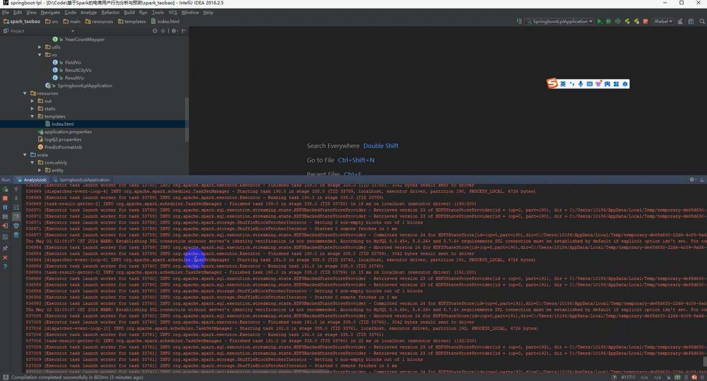
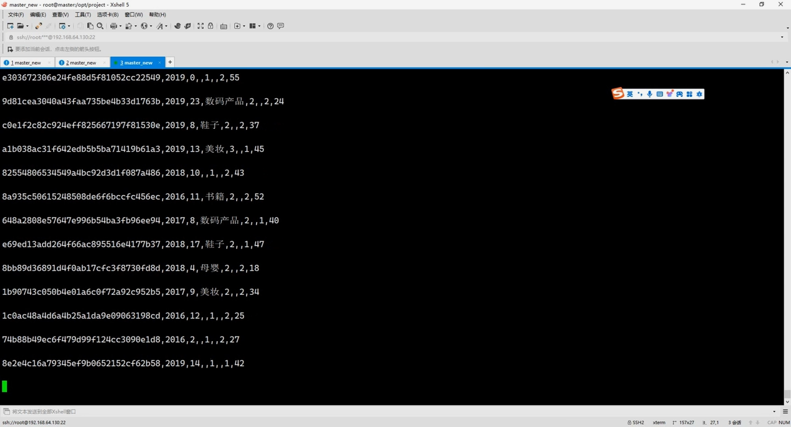

## 计算机毕业设计Spark+Hadoop+Kafka+Flume实时电商用户数据分析与预测 电商用户画像系统 用户行为分析 电商日志分析 大数据毕业设计 机器学习

## 要求
### 源码有偿！一套(论文 PPT 源码+sql脚本+教程)

### 
### 加好友前帮忙start一下，并备注github有偿Spark电商25
### 我的QQ号是2827724252或者798059319或者 1679232425或者微信:bysj2023nb 或bysj1688

# 

### 加qq好友说明（被部分 网友整得心力交瘁）：
    1.加好友务必按照格式备注
    2.避免浪费各自的时间！
    3.当“客服”不容易，repo 主是体面人，不爆粗，性格好，文明人。
	
## 说明	
基于Spark+Hadoop+Kafka+Flume的电商用户行为实时分析与预测系统，数据来源【阿里】天池

## 演示视频
https://www.bilibili.com/video/BV12i42167he/?spm_id_from=333.999.0.0

## 截图

